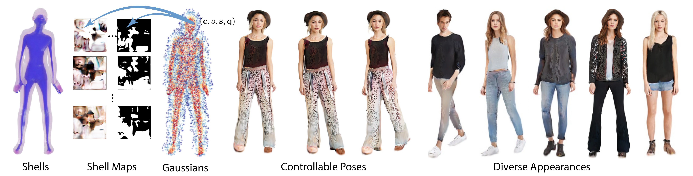

## Gaussian Shell Maps for Efficient 3D Human Generation <br>



**Efficient Geometry-aware 3D Generative Adversarial Networks**<br>
Rameen Abdal*, Wang Yifan*, Zifan Shi*, Yinghao Xu, Ryan Po, Zhengfei Kuang, Qifeng Chen, Dit-Yan Yeung, and Gordon Wetzstein<br>*\* equal contribution*<br>
<br>https://rameenabdal.github.io/GaussianShellMaps/<br>

Abstract: *Efficient generation of 3D digital humans is important
in several industries, including virtual reality, social media,
and cinematic production. 3D generative adversarial networks (GANs) have demonstrated state-of-the-art (SOTA)
quality and diversity for generated assets. Current 3D GAN
architectures, however, typically rely on volume representations, which are slow to render, thereby hampering the GAN
training and requiring multi-view-inconsistent 2D upsamplers. Here, we introduce Gaussian Shell Maps (GSMs) as
a framework that connects SOTA generator network architectures with emerging 3D Gaussian rendering primitives
using an articulable multi shell–based scaffold. In this setting, a CNN generates a 3D texture stack with features that
are mapped to the shells. The latter represent inflated and
deflated versions of a template surface of a digital human
in a canonical body pose. Instead of rasterizing the shells
directly, we sample 3D Gaussians on the shells whose attributes are encoded in the texture features. These Gaussians are efficiently and differentiably rendered. The ability
to articulate the shells is important during GAN training
and, at inference time, to deform a body into arbitrary userdefined poses. Our efficient rendering scheme bypasses the
need for view-inconsistent upsamplers and achieves highquality multi-view consistent renderings at a native resolution of 512 × 512 pixels. We demonstrate that GSMs successfully generate 3D humans when trained on single-view
datasets, including SHHQ and DeepFashion.*


## Installation 


* Python libraries: see [environment.yml](./environment.yml) for exact library dependencies.  You can use the following commands with Miniconda3 to create and activate your Python environment:

  - `conda env create -f environment.yml`
  - `conda activate gsm`

* Install smplx and batch-diff-gaussian-rasterization in submodules:
  - `cd submodules`
  - `cd smplx`
  - `python setup.py develop` 
  - `cd batch-diff-gaussian-rasterization`
  - `python setup.py install`


## Getting started

Pre-trained networks are stored as `*.pkl`. See [here](https://drive.google.com/file/d/19TFlxRnKY5GGI8c7hfL0kiLG_UaP2UWR/view?usp=sharing) for pre-trained checkpoints and files.


## Generate Interpolations

```.bash
# Generate interpolation videos using pre-trained model

cd main/gsm

python gen_interpolation.py --network xxxx.pkl --outdir xxxx --z_seeds 251,58

# Other seeds to try on DeepFashion:

Seeds: 297,235,27,41,135,903,894,570,361,369
```

    
## Generate Novel Poses

```.bash
# Generate novel poses using pre-trained model

cd main/gsm

python gen_novel_pose.py --network xxxx.pkl --outdir xxxx --seq ../../assets/seq_novel_pose.npy --z_seeds 58 --reload_modules True

# Other seeds to try on DeepFashion:

Seeds: 745,962,853,621,190
```

## Editing 

```.bash
# Generate upper body edits using pre-trained model

cd main/gsm

python gen_editing.py --network xxxx.pkl --seeds 0,1,2 --seeds_tobereplaced 6162 --trunc 0.7 --resolution 512 --outdir xxxx --pts_path ../../assets/editing/select_upper.txt --reload_modules True

# Generate lower body edits using pre-trained model

python gen_editing.py --network xxxx.pkl --seeds 0,1,2 --seeds_tobereplaced 6162 --trunc 0.7 --resolution 512 --outdir xxxx --pts_path ../../assets/editing/select_trousersshoes.txt --reload_modules True

```

## Generate Animated Sequences

```.bash
# Generate animated sequences and view on html using pre-trained model

cd main/gsm

python gen_animation_videos.py --network xxxx.pkl --outdir xxxx --z_seeds 137

# Other seeds to try on DeepFashion:

Seeds: 67,468,543,718,847,895,66,82,848,952,958,974
```


## Training

(to be updated)


## Citation

```
@misc{abdal2023gaussian,
      title={Gaussian Shell Maps for Efficient 3D Human Generation}, 
      author={Rameen Abdal and Wang Yifan and Zifan Shi and Yinghao Xu and Ryan Po and Zhengfei Kuang and Qifeng Chen and Dit-Yan Yeung and Gordon Wetzstein},
      year={2023},
      eprint={2311.17857},
      archivePrefix={arXiv},
      primaryClass={cs.CV}
}
```


## Acknowledgements

 We thank the authors of 3D Gaussian Splatting, Bernhard Kerbl, Georgios Kopanas, and George Drettakis for the discussions on the code. We thank Thabo Beeler and Guandao Yang for fruitful discussions and Alexander Bergman for helping with the baseline comparisons. We also thank the authors of GetAvartar for providing additional evaluation results. This work was in part supported by Google, Samsung, Stanford HAI, and the Swiss Postdoc Mobility Fund.
